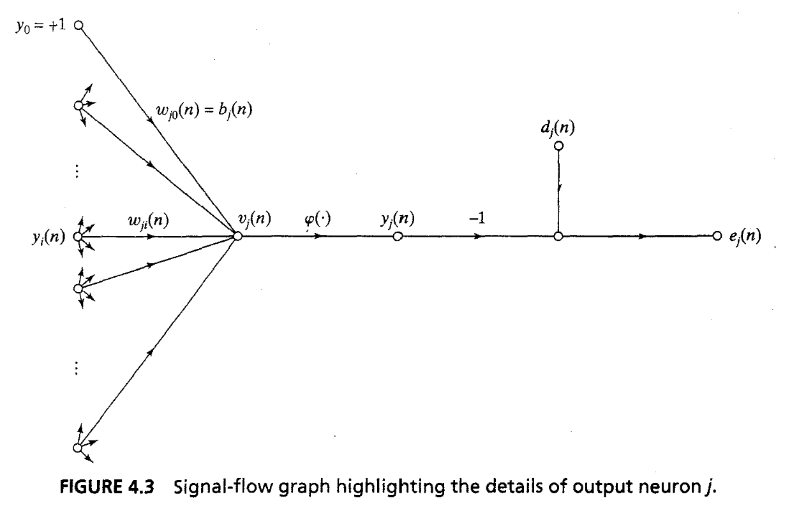

### Back Propagation

The point of backpropagation is to send the error signal back to the hidden neurons, so that learning occurs there as well. 

$$
e_{j}(n) = d_{j}(n) - y_{j}(n)
$$

where $e_{j}(n)$ is the error signal at output neuron j at iteration n.
The instantaneous value of the energy error for all neurons in output layer.

$$E(n) = \frac{1}{2} \sum_{j \in C}e^2_j(n)$$

where the set $C$ is all the neurons in the output layer.
Consider the below diagram,

The local induced field $v_j(n)$ is the dot product of the weight vector and input vector.

$$
v_j(n) = \sum_{i=0}^n w_{ij}(n).y_i(n)
$$

The above image considers the bias to be a part of the weights by setting the input for it to +1.
The output signal $y_j(n)$ is application of an activation function on $v_j(n)$.

$$
y_j(n) = \psi_j(v_j(n))
$$

where $\psi_j$ is the activation function on the $j^{th}$ neuron.
All the above formulas are precursors required to derive the backpropagation equation. In a manner similar to the LMS algorithm, the back-propagation algorithm applies a correction $\Delta w_{ij}(n)$ to the synaptic weight $w_{ij}(n)$, which is proportional to the partial derivative $\frac{\delta E(n)}{\delta w_{ij}(n)}$. Through the chain rule, we can express this as

$$
\frac{\delta E(n)}{\delta w_{ij}(n)} = \frac{\delta E(n)}{\delta e_{j}(n)}\frac{\delta e_j(n)}{\delta y_{j}(n)}\frac{\delta y_j(n)}{\delta v_{j}(n)}\frac{\delta v_j(n)}{\delta w_{ij}(n)}
$$

Through the above formulas,

$$
\frac{\delta E(n)}{\delta e_{j}(n)} = e_j(n)
$$

$$
\frac{\delta e_j(n)}{\delta y_{j}(n)} = -1
$$

$$
\frac{\delta y_j(n)}{\delta v_{j}(n)} = \psi'(v_j(n))
$$

$$
\frac{\delta v_j(n)}{\delta w_{ij}(n)} = y_j(n)
$$

Putting all the equations together, 

$$
\frac{\delta E(n)}{\delta w_{ij}(n)} = -e_j(n).\psi'(v_j(n)).y_j(n)
$$

Through the delta rule, the correction $\Delta w_{ji}(n)$ applied to $w_{ji}(n)$ is defined by 

$$
\Delta w_{ji}(n) = -\eta \frac{\delta E(n)}{\delta w_{ij}(n)}
$$

Therefore, the weight update equation becomes as follows,

$$
\Delta w_{ji}(n) = \eta.\delta_j(n).y_j(n)
$$

where, the local gradient $\delta_j(n)$ is defined by,

$$
\delta_j(n) = -\frac{\partial{E(n)}}{\partial v_j(n)} 
$$
$$
= e_j(n).\psi'(v_j(n))
$$

This is the case for an output neuron, since the desired output is known. However for a hidden neuron whose desired output is not known, the following formula needs to be used.

$$
\delta_j(n) = \psi'(v_j(n))\sum_k\delta_k(n)w_{kj}(n)
$$

where neuron $j$ is hidden.

### Activation Functions

In order to find $\delta$ for each neuron of the multilayer perceptron requires knowledge of the derivative of the activation function. For derivative to exist, the function must be continuous.